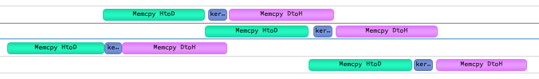
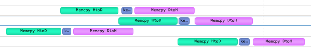

## [CUDA 101: Get Ahead of the CUDA Curve with Practice!](https://developer.nvidia.com/blog/cuda-101-get-ahead-cuda-curve-practice/)

Practice is necessary for experience.
First solve any problem (e.g. past college assignments) in CPU.
Time the solution using wall clock and then port the solution to GPU.

## [Assess, Parallelize, Optimize, Deploy](https://developer.nvidia.com/blog/assess-parallelize-optimize-deploy/)

The process of porting application to GPU consists of 4 stages:

### 1. Assess

Asses which part is taking the most time by analyzing the app with one or more realistic data sets.
Profile to provide evidences for your intuition.
Be aware of the profiling overhead when collecting many metrics (similar to Heisenberg's Uncertainty Principle).

### 2. Parallelize

There are 3 main ways to parallelize:

- GPU-accelerated libraries
- OpenACC directives
- GPU programming language

### 3. Optimize

- Algorithm choice
- Data movement

### 4. Deploy

Key points for productizing GPU-accelerated code:

- Check the return value from API calls
- Consider how to distribute the CUDA runtime and libraries
- Use tools to monitor GPUs

## [An Easy Introduction to CUDA C and C++](https://developer.nvidia.com/blog/easy-introduction-cuda-c-and-c/)

[Code](src/easy_intro_to_cuda.cu)

The blog is about implementing SAXPY (Single-precision A \* X Plus Y) in CUDA.

## [How to Implement Performance Metrics in CUDA C/C++](https://developer.nvidia.com/blog/how-implement-performance-metrics-cuda-cc/)

[Code](src/performance_metrics.cu)

The blog is about measuring effective memory bandwidth in SAXPY.

`cudaEventElapsedTime` has a resolution of approx 0.5 us.

NVIDIA Tesla M2050:

- DDR
- Memory Clock Rate: 1546 MHz
- Memory Interface: 384 bit
- Theoritical Bandwidth: 1546 x 10 ^ 6 x (384 / 8) x 2 / 10 ^ 9 = 148 GB/s

Effective Bandwidth = (R_B + W_B) / (t \* 10 ^ 9).

RTX 4090: 893.621946 GB/s.

## [How to Query Device Properties and Handle Errors in CUDA C/C++](https://developer.nvidia.com/blog/how-query-device-properties-and-handle-errors-cuda-cc/)

[Code](src/query_dev_handle_error.cu)

The blog is about calculating theoritical peak memory bandwidth using `cudaGetDeviceProperties` and error handling in CUDA.

```bash
Device number: 0
    Device name: NVIDIA GeForce RTX 4090
    Memory Clock Rate (KHz): 10501000
    Memory Bus Width (bits): 384
    Peak Memory Bandwidth (GB/s): 1008.1
```

## [How to Optimize Data Transfers in CUDA C/C++](https://developer.nvidia.com/blog/how-optimize-data-transfers-cuda-cc/)

[Code](src/data_transfer.cu)

The blog is about using profiler (older version of `nsys`) and
using pinned memory to transfer with higher bandwidth between host and device.

```bash
Device: NVIDIA GeForce RTX 4090
Transfer size (MB): 16

Pageable transfer
    Host to Device bandwidth (GB/s): 11.2212
    Device to Host bandwidth (GB/s): 7.96693

Pinned transfer
    Host to Device bandwidth (GB/s): 24.9044
    Device to Host bandwidth (GB/s): 25.9664
```

## [How to Overlap Data Transfers in CUDA C/C++](https://developer.nvidia.com/blog/how-overlap-data-transfers-cuda-cc/)

[Code](src/overlap_data_transfer.cu)

The blog is about using multiple streams to overlap copy with execution.

Baseline: 
Async v1: 
Async v2: 

```bash
Device : NVIDIA GeForce RTX 4090
Time for sequential transfer and execute (ms): 1.68467
    max error: 1.19209e-07
Time for asynchronous V1 transfer and execute (ms): 0.930848
    max error: 1.19209e-07
Time for asynchronouse V2 transfer and execute (ms): 0.924768
    max error: 1.19209e-07
```

Eventually the code should use non-default streams or per-thread default stream.
This is especially important for libraries.
If code in a library uses the default stream,
there is no chance for the end user to overlap data transfers with the library kernel execution.

## [Expressive Algorithm Programming with Thrust](https://developer.nvidia.com/blog/expressive-algorithmic-programming-thrust/)

[Code](src/thrust_intro.cu)

[Thrust](https://nvidia.github.io/cccl/thrust/) is CUDA version of C++ Standard Library.
