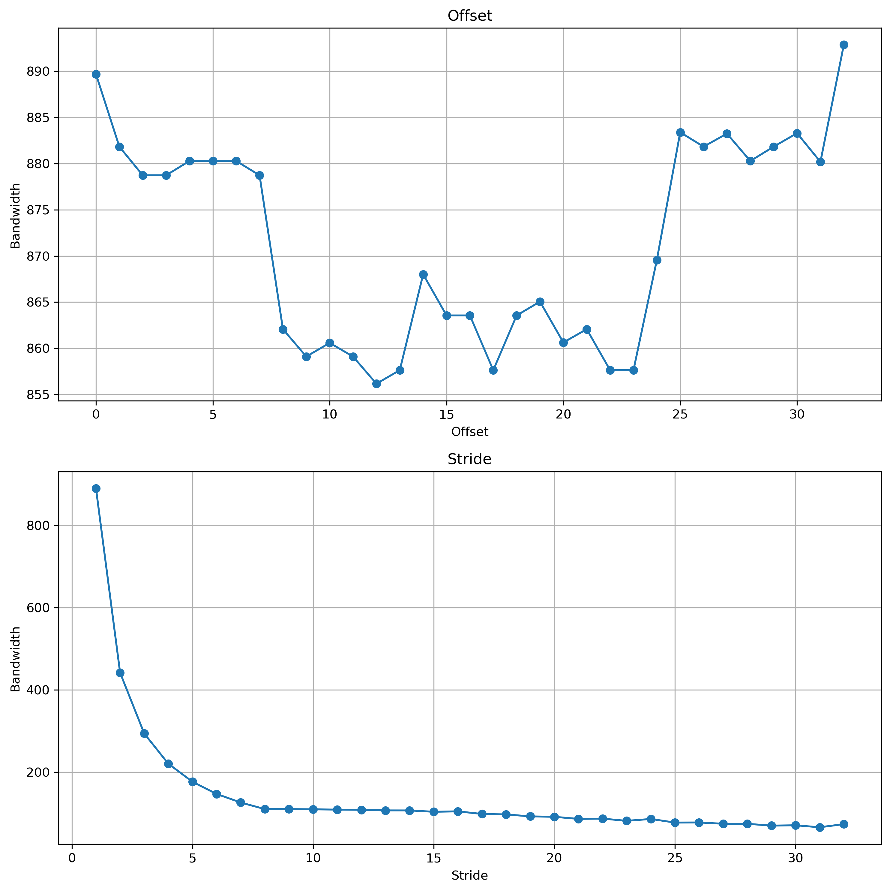
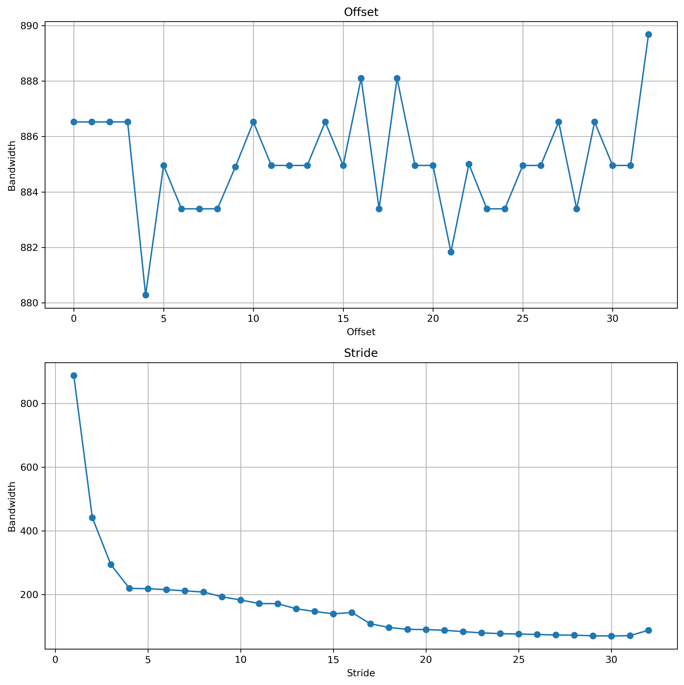

## [CUDA Pro Tip: Flush Denormals with Confidence](https://developer.nvidia.com/blog/cuda-pro-tip-flush-denormals-confidence/)

This blog is about denormal floating point numbers.
The denormals allows what is known as "gradual underflow" when a result is too small, and helps avoid catastrophic division-by zero errors.
Gradual or graceful underflow is using denormals to let number fade smoothly toward 0 instead of abruptly snapping to zero.
In GPU, there are some cases where it has to take a slower path for denormal values.
One way to avoid denormals is to add small "noise" so that the number is guaranteed to be denormal.
`nvcc` provides the cmdline option `-ftz=true` which causes all denormalized numbers to be flushed to zero.

## [How to Access Global Memory Efficiently in CUDA C/C++ Kernels](https://developer.nvidia.com/blog/how-access-global-memory-efficiently-cuda-c-kernels/)

[Code](src/gmem_access.cu)

The blog explored kernels that are shifted with fixed offsets and that are strided.

The most important take-away from this blog is that the device coalesces global memory loads and stores issued by warp into as few transactions as possible to minimize DRAM bandwidth.

Arrays allocated in device memory (`cudaMalloc`) are aligned to 256B memory segments by the CUDA driver.

On modern GPU architecture, device memory access with offset has no issue but strided memory access can hurt performance.

Single Precision: 
Double Precision: 

## [Using Shared Memory in CUDA C/C++](https://developer.nvidia.com/blog/using-shared-memory-cuda-cc/)

[Code](src/smem.cu)

The blog introduces the shared memory:

1. Sharing data over shared memory using `__syncthreads()`.
2. Some hardware details including memory banks and broadcast.
3. CUDA API(s) related to shared memory configuration.

## [An Efficient Matrix Transpose in CUDA C/C++](https://developer.nvidia.com/blog/efficient-matrix-transpose-cuda-cc/)

[Code](src/matrix_transpose.cu)

The blog is about transposing matrix using the shared memory.

The highlight of this blog is using extra padding to avoid shared memory bank conflict.
